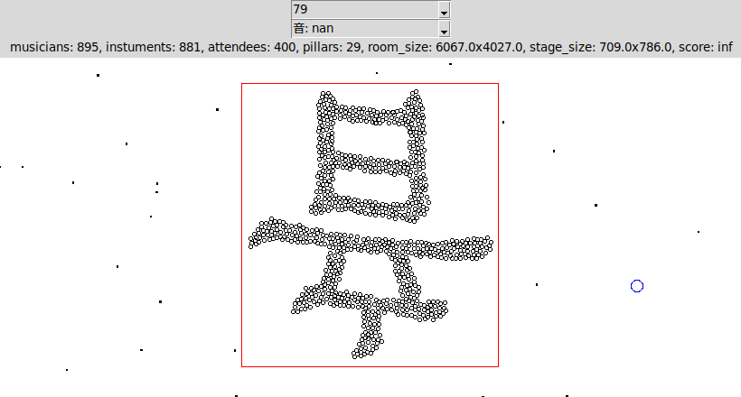
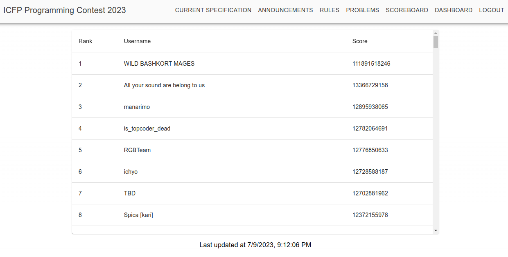

## ICFPC 2023 submission by WILD BASHKORT MAGES :magic_wand:

The mages are:
- Damir Akhmetzyanov (linesprower@gmail.com),
- Max Mouratov (me@murmour.me),
- Artem Ripatti (ripatti@inbox.ru).

...

Hello there!

This year's ICFPC is special and quite strange for us, because we are doing it not from the forests of [Bashkortostan](https://en.wikipedia.org/wiki/Bashkortostan) (as always), but from Japan, Tokyo, to which we have teleported randomly during a magical ritual (it was a spell typo I think).

Since the start of the contest coincided with [たなばた](https://en.wikipedia.org/wiki/Tanabata), we've left a message to the local teams:

Our message was "**beware of wild sorcerers**", and it must have totally reached the said teams, judging by their success in this contest -- at least half of the top 25 teams on the frozen scoreboard were Japanese. We can only imagine how stressful it must have been to be chased by the actual wild mages, who were getting more and more points all the time. Not to mention our signature magical influence, that was quite strong in the Tokyo area. Perhaps it even was beneficial.

Since we're in Japan, we chose the powerful and mystical Kanji characters as our spiritual theme in this contest. The influence of Kanji on us was so strong that it found way into this very submission. Use our visualizer to see solutions to problems 79, 68, 58, 61, 62. According to our computations, these solutions give *so much* points, that we decided to spare the humanity, and restrained ourselves from ever submitting them to the scoreboard. After all, these solutions must only be witnessed in a safe and controlled environment.

Speaking of Kanji,

Folder `問` contains problems, and folder `答` contains solutions to problems.

`目` is is our visualizer (in Python). Launch it via `python3 目.py`. Hidden features: mouse-wheel zooming, mouse-click panning.

`手` is our all-purpose plumbing toolbox (in Python).

`脳` is our solver (in C++).

...

`脳` uses a constructive algorithm based on dynamic programming and flow networks.

The algorithm relies on the fact that once the set of the musicians' positions is settled, we can find the optimal assignment of musicians using the Hungarian algorithm. It disregards the "playing together" extension, but we ignored it deliberately. So, our solution has two steps: first, a set of positions is generated; then, specific musicians are assigned to these positions. We tried various strategies to generate the set of positions, including various random placements, regular placements along the stage edges, and many others. In most problems, we got best results with one of these two approaches:

1) For each attendee, generate a set of candidate positions, placing the musicians as close as possible to that attendee in a two-row arrangement. Then, sort all the positions obtained this way using `max(attendee_tastes) / (10 + distance_to_stage)^2` as the sorting criterion. Then, take these positions in order, discarding those of them that overlap with the previously taken positions, obtaining a non-overlapping set of candidate positions. Use the assignment problem to select a subset of this set (at this step we ignore the fact that the musicians may block each other).

2) Use dynamic programming to determine candidate positions along the edges of the stage. The musicians can be placed in the first or second row. Positions are chosen from a fixed-step (~0.1 units) grid. For the cost function we make the assumption that we will be able to place a musician with any instrument into any position. However, we accurately model the mutual blocking by the musicians. We also used various post-processing steps, like trying to improve the solution by moving musicians in the direction that increases the score, placing blocked musicians close to their peers for the "playing together" bonus, muting musicians that have negative score. However, the overall impact of post-processing was not significant.

The solver is quite fast and doesn't need a compute cloud. A few laptop cores are enough.

However, the efficiency of the approach is quite limited, as our results show: 12th place on the frozen scoreboard, 8th in the lightning round. Perhaps we should have went with a stochastic approach this time, as it was too difficult to figure out what the optimal solutions are like. At the very least, we could have used a stochastic approach for exploration. After all, imagination is what computers are great at (as 2023 shows).

At one point in the contest we got bored and used the power of Kanji:

Boom. "Beware of wild sorcerers" was not a joke. It was a serious warning. Alas, other teams did a great job at repelling our threat, and we were defeated. How sad.

Guess we'll strike back in 2024 then.

野生の魔術師に用心! :magic_wand:
